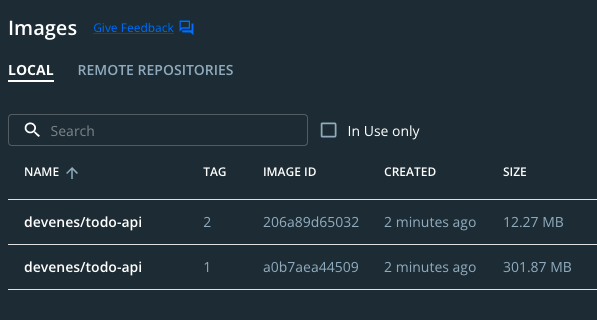

<div align="center" id="top"> 
  
</div>

<h1 align="center">Todo List API</h1>

<p align="center">
  
  
  
  
  
  
  
  
  
  <!--  -->
  <!--  -->
  <!--  -->
</p>

<p align="center">
  <a href="#dart-about">About</a> &#xa0; | &#xa0; 
  <a href="#sparkles-features">Features</a> &#xa0; | &#xa0;
  <a href="#rocket-technologies">Technologies</a> &#xa0; | &#xa0;
  <a href="#white_check_mark-requirements">Requirements</a> &#xa0; | &#xa0;
  <a href="#checkered_flag-starting">Starting</a> &#xa0; | &#xa0;
  <a href="#--Multi-Stage-Containerization">Containerization</a> &#xa0; | &#xa0;
  <a href="#memo-license">License</a> &#xa0; | &#xa0;
  <a href="https://github.com/devenes" target="_blank">Author</a>
</p>

## :dart: About

This API is a simple todo list. It is a RESTful API that allows you to create, read, update and delete todos.

## :sparkles: Features

| Parameter | Type     | Description                  |
| :-------- | :------- | ---------------------------- |
| `id`      | `string` | The id of the todo object    |
| `title`   | `string` | The title of the todo object |

:heavy_check_mark: List todos\
:heavy_check_mark: Get todo status\
:heavy_check_mark: Create a new todo object\
:heavy_check_mark: Delete a todo object

## :rocket: Technologies

The following tools were used in this project:

- [Go](https://golang.org/): The language used in this project
- [Docker](https://www.docker.com/): The containerization tool used in this project
- [GitHub](https://www.github.com/): The source control tool used in this project
- [GitHub Actions](https://github.com/actions/): The continuous integration tool used in this project

## :white_check_mark: Requirements

Before starting :checkered_flag:, you need to have [Git](https://git-scm.com), [Docker](https://www.docker.com/), and [Go](https://golang.org) installed.

## :checkered_flag: Starting

- Clone the project

```bash
git clone https://github.com/devenes/todos-api
```

- Go to the project directory:

```bash
cd todos-api
```

- Run the following command to start the server:

```bash
go run main.go
```

- You can also run the server in the background:

```bash
go run main.go &
```

- Build the Docker image:

```bash
docker build -t devenes/todos-api:1 ./
```

- You can also run the server in a Docker container:

```bash
docker run -p 8080:8080 -d devenes/todos-api:1
```

- List todos with the following command:

```bash
curl http://localhost:8080/todos
```

- Get the first todo with the following command:

```bash
curl http://localhost:8080/todos/1
```

- Create a new todo with the following command:

```bash
curl -X POST -H 'content-type: application/json' --data '{"id": "4", "title": "Buy milk"}' http://localhost:8080/todos
```

- Update the first todo with the following command:

```bash
curl -X POST -H 'content-type: application/json' --data '{"id": "1", "title": "Check the mailbox"}' http://localhost:8080/todos
```

- Delete the first todo with the following command:

```bash
curl -X DELETE http://localhost:8080/todos/1
```

- Get the second todo with the following command:

```bash
curl http://localhost:8080/todos/2
```

## 🐳 Multi-Stage Containerization

You can reduce the size of the Docker image from 301MB to 12MB by using multi-stage containerization. Check the [Dockerfile](Dockerfile) to see how it works and look at the latest image created with alpine.



## :memo: License

This project is under license from Apache 2.0. For more details, see the [LICENSE](LICENSE) file.

Made with :heart: by <a href="https://github.com/devenes" target="_blank">devenes</a>

&#xa0;

<a href="#top">⬆️ Back to top</a>
